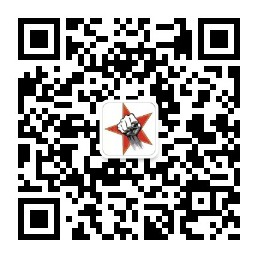

## About Me

> 1. **微信公众号**：

> 2. **github地址**: [https://github.com/qinjisheng2018](https://github.com/qinjisheng2018)

> 3. **联系邮箱地址：qinjisheng2018@163.com**

# [秦大圣的博客](https://qinjisheng.top)

> 1. **博客首页**：最新发布的博客内容

 

 

 

> 2. **科研学习**：关于科研的内容

包括：图神经网络

 

 

 

> 3. **分类汇总**：安装标签分类

包括：工具的安装与使用

 

 

 

> 4. **友情链接**：追踪大神的脚步和一些友链

包括：追踪大神的脚步、友情链接等

 

 

 

> 5. **个人简介**：主要介绍个人的一些情况

包括一些个人信息、项目基金、发表论文等