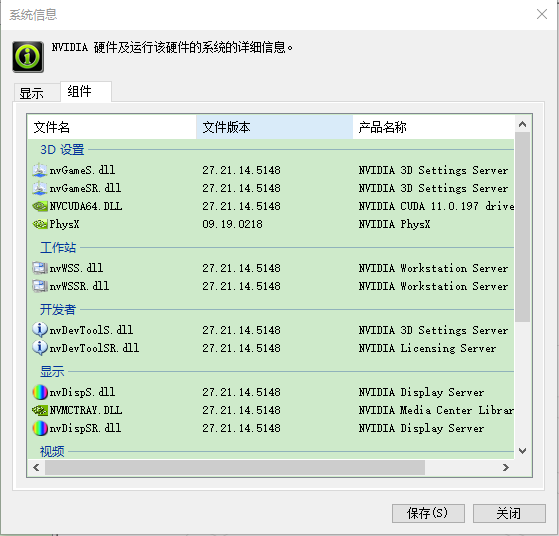
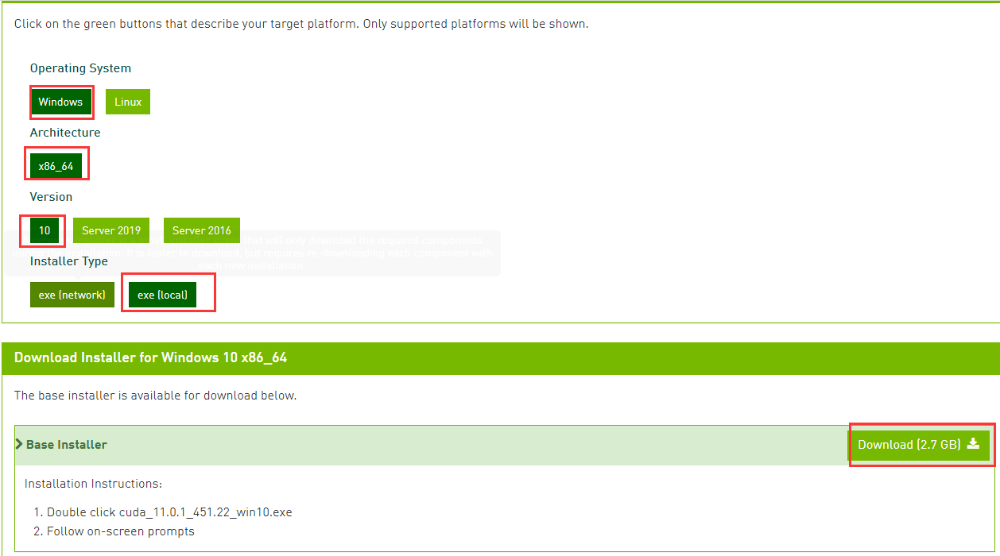
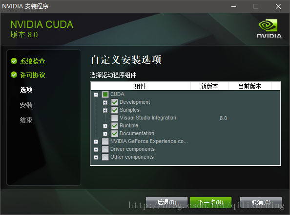
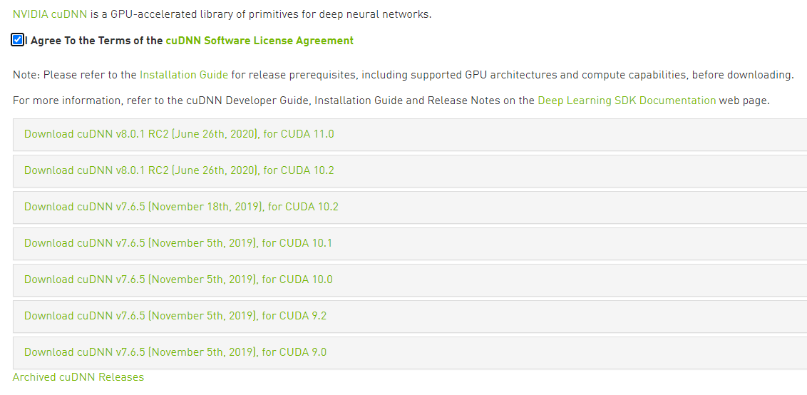
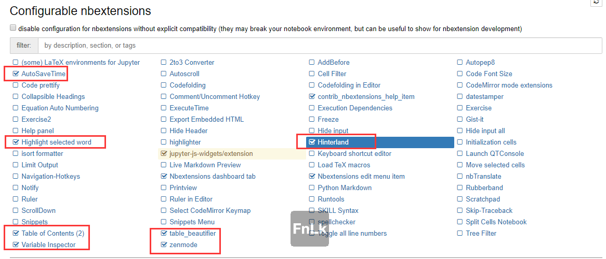
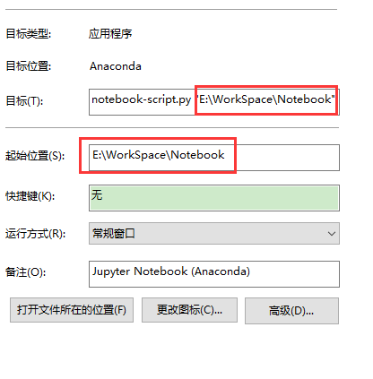

## 1. Anaconda的安装

[TOC]


### 1.1 软件下载

> Anaconda官方下载地址：[https://www.anaconda.com/products/individual](https://www.anaconda.com/products/individual)
>
> 清华镜像下载地址：[https://mirrors.tuna.tsinghua.edu.cn/anaconda/archive/](https://mirrors.tuna.tsinghua.edu.cn/anaconda/archive/)

可以使用中方法中的任意一种，如果能翻墙，还是建议使用官方下载。


## 1.2 软件安装

- 1) 保证文件所在路径没有中文和空格，最好的方法就是拷贝到根目录盘下

- 2) 安装时候可以选择**`Just me`**或者**`All Users`**都行


- 3) 选择要安装的目录，或者使用默认都行

- 4) **注意：**勾上路径

  

- 安装完成


## 1.3 配置

配置部分很重要，配置好用着舒服

### 1.3.1 PIP

首先要对pip进行换源，下载能速度快点，源有很多，我只推荐我使用的。

- 新建一个 **`pip`**  文件夹，注意大小写
- 新建一个 **`txt`** 文件，命名 **`pip`**，内容如下(直接拷贝，不要手打)

```
[global]
index-url = http://pypi.douban.com/simple
[install]
trusted-host = pypi.douban.com
```


-  **`txt`** 文件改后缀名为 **`ini`**
- 将整个文件夹都放入 **`C:\Users\用户名\AppData\Roaming`** 目录下


### 1.3.2 配置代码补全

代码补全需要安装nbextensions：

- 在开始**`菜单`**找到  Anaconda3目录，找到Ananconda Prompt(Anaconda)
- 使用如下命令(一行一行拷贝运行)

```txt
pip install jupyter_contrib_nbextensions
jupyter contrib nbextension install --user
```


## 1.4 安装CUDA

要使用PyTorch需要安装CUDA，使用GPU

### 1.4.1 看看需要的CUDA版本

- **控制面板**  –>  **查看方式：小图标** --> **NVIDIA控制面板**  -- > **帮助** –> **系统信息** –> **组件**  --> **产品名称CUDA 11** （代表显卡能支持的CUDA的最高版本）




- CUDA官网下载：[CUDA Toolkit](https://developer.nvidia.com/cuda-downloads?target_os=Windows&target_arch=x86_64&target_version=10&target_type=exelocal)，注意选择



- 安装下载文件，主要要自动以安装选项，这里组件有个当前版本，如果显示版本，代表你电脑里面已经安装，没必要覆盖，直接勾掉，一般选择如下：



- 下载[cudann](https://developer.nvidia.com/rdp/cudnn-download)，选择对应的版本



- 解压cudann，并里面的文件拷贝到**`C:\Program Files\NVIDIA GPU Computing Toolkit\CUDA\v10.2`**对应的文件夹中
- 配置Path路径，增加一条**`C:\Program Files\NVIDIA GPU Computing Toolkit\CUDA\v10.2\lib\x64`**
- 测试是否安装成功：使用**`CMD命令跳转到`**：**`C:\Program Files\NVIDIA GPU Computing Toolkit\CUDA\v10.2\extras\demo_suite`**，

然后运行:**deviceQuery.exe**和**bandwidthTest.exe**,出现两个**Result=PASS**就行


## 1.5 安装PyTorch

> **注意：**不要随便更新 conda、anaconda等，防止出现未知的错误

1. 查看Anaconda环境

   ```
   conda info -e
   ```

2. 创建PyTorch的子环境，名称随便取

```txt
conda create -n PyTorch python=3.7 anaconda
```

3. 激活子环境（子环境拷贝一个环境，你安装PyTorch，或者其他的，不相互干扰）

```txt
conda activate PyTorch
```

4. 安装PyTorch，推荐翻墙安装，如果没有梯子，去掉`-c pytorch`

```txt
conda install pytorch torchvision cudatoolkit=10.1 -c pytorch
```

## 1.6 修改Jupyter Notebook的显式

> 不得不吐槽，Notebook的字体下，而且注释还是斜体的，很难看


### 1.6.1 第一步配置：Anaconda配置

1. 配置Anaconda原始环境下的Notebook显式，将**custom.css**文件替换掉，原文件地址

```txt
C:\Anaconda\Lib\site-packages\notebook\static\custom
```

2. 配置PyTorch环境下的Notebook显式，将**custom.css**文件替换掉，原文件地址

```txt
C:\Anaconda\envs\PyTorch\lib\site-packages\notebook\static\custom
```

3. 新的**custom.css**[1]文件内容为：（里面的显示可以自己根据喜好更改）

```css
/* Body */
 #notebook-container {
    width: 90%
} 

/* Markdown */
div#notebook {
    font-family: san francisco, "PingFangSC-Medium", "Microsoft YaHei";
    line-height: 20px;
    -webkit-font-smoothing: antialiased !important;
}

/* Markdown - h2 */
div#notebook h2 {
    color: #007aff;
}

/* Markdown - quote */
div#notebook blockquote{
    background-color: #f8f8f8;
    color: #505050;
    padding: 8.5px;
    margin: 0.5em -0.5em 0.5em -0.4em;
}

/* Markdown - code in paragraph */
div#notebook p code, div#notebook li code {
    font-family: Consolas, "微软雅黑";
    font-size: 1em !important;
    color: #111111;
    border: 0.5px solid #cfcfcf;
    border-radius: 2px;
    background-color: #f7f7f7;
    padding: .1em .2em;
    margin: 0px 2px;
}

/* Markdown - code */
div.text_cell_render pre {
    border: 1px solid #cfcfcf;
    border-radius: 2px;
    background: #f7f7f7;
    line-height: 1.21429em;
    padding: 8.5px;
    margin: 0.5em -0.5em 0.5em -0.4em;
}
div.text_cell_render code {
    background: #f7f7f7;
}

/* Code */
div.CodeMirror pre {
    font-family: Consolas, "微软雅黑";
    font-size: 13pt !important;
    line-height: 140% !important;
    -webkit-font-smoothing: antialiased !important;
}

/* Code - output */
div.output pre {
    font-family: Consolas, "微软雅黑";
    line-height: 20px;
    font-size: 12pt !important;
    -webkit-font-smoothing: antialiased !important;
}

/* Code - comment */
span.cm-comment {
    font-family: san francisco, "PingFangSC-Medium", "Microsoft YaHei" !important;
    font-style: normal !important;
    font-size: 12pt !important;
}

/* Code - highlighting */
.cm-s-ipython .CodeMirror-cursor {
    border-left: 1px solid #ff711a !important;
}
.cm-s-ipython span.cm-comment {
    color: #8d8d8d;
    font-style: italic;
}
.cm-s-ipython span.cm-atom {
    color: #055be0;
}
.cm-s-ipython span.cm-number {
    color: #ff8132;
}
.cm-s-ipython span.cm-property {
    color: #303030;
}
.cm-s-ipython span.cm-attribute {
    color: #303030;
}
.cm-s-ipython span.cm-keyword {
    color: #713bc5;
    font-weight: bold;
}
.cm-s-ipython span.cm-string {
    color: #009e07;
}
.cm-s-ipython span.cm-meta {
    color: #aa22ff;
}
.cm-s-ipython span.cm-operator {
    color: #055be0;
}
.cm-s-ipython span.cm-builtin {
    color: #e22978;
}
.cm-s-ipython span.cm-variable {
    color: #303030;
}
.cm-s-ipython span.cm-variable-2 {
    color: #de143d;
}
.cm-s-ipython span.cm-variable-3 {
    color: #aa22ff;
}
.cm-s-ipython span.cm-def {
    color: #e22978;
    font-weight: bold;
}
.cm-s-ipython span.cm-error {
    background: rgba(191, 97, 106, .40);
}
.cm-s-ipython span.cm-tag {
    color: #e22978;
}
.cm-s-ipython span.cm-link {
    color: #ff8132;
}
.cm-s-ipython span.cm-storage {
    color: #055be0;
}
.cm-s-ipython span.cm-entity {
    color: #e22978;
}
.cm-s-ipython span.cm-quote {
    color: #009e07;
}
div.CodeMirror span.CodeMirror-matchingbracket {
    color: #1c1c1c;
    background-color: rgba(30, 112, 199, .30);
}
div.CodeMirror span.CodeMirror-nonmatchingbracket {
    color: #1c1c1c;
    background: rgba(191, 97, 106, .40) !important;
}
.cm-s-default .cm-hr {
    color: #055be0;
}
```


### 1.6.2 第二步配置：设置浏览器显示字体

1. 打开谷歌浏览器 ---> 字体
2. 自定义字体

```txt
serif -> Arial
Sans-serif -> 微软雅黑
宽度固定字体 --> Arial
```


## 1.7 配置提示信息

打开Jupyter Notebook，配置nbextensions，配置如图：




## 1.8 配置Jupyter Notebook打开地址

**开始菜单**  -->  **Anaconda3** -->**Jupyter Notebook（Anaconda）** --> **右键**  –> **更多**  –> **打开文件所在位置**  --> JupyterNotebook创建一个快捷方式在桌面上  –> 右键属性  --> 改两个位置

- 目标里面的，最后部分双引号里面
- 起始位置

以上两个地址都改成你的项目地址，下次启动，自动从这个位置打开。




[1] : custom.css 的代码是根据知乎中，万欣的回答修改的。具体地址为[jupyter notebook中显示字体如何调整？ - 知乎 https://www.zhihu.com/question/40012144](jupyter notebook中显示字体如何调整？ - 知乎 https://www.zhihu.com/question/40012144)